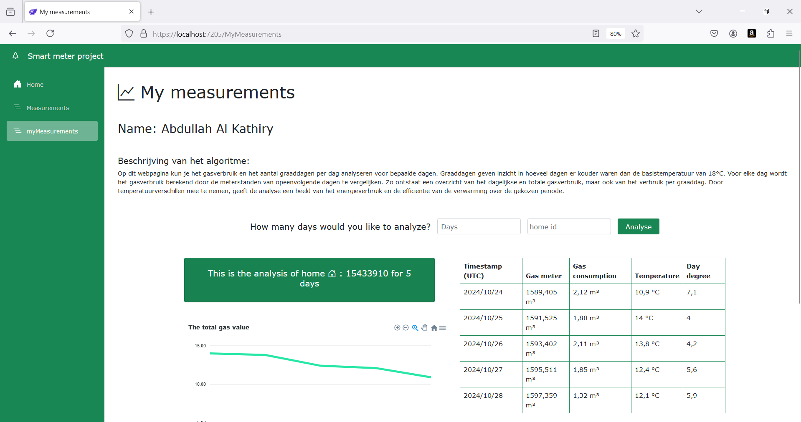

In dit project heb ik een algoritme gemaakt om de gegevens van het gasverbruik van huizen te analyseren op basis van de buitentemperatuur en de daggraden. Het goal was de relatie tussen temperatuur en gasverbruik begrijpen Voor efficiënt energieverbruik.

